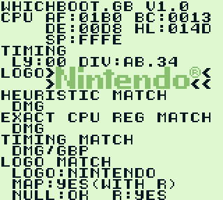
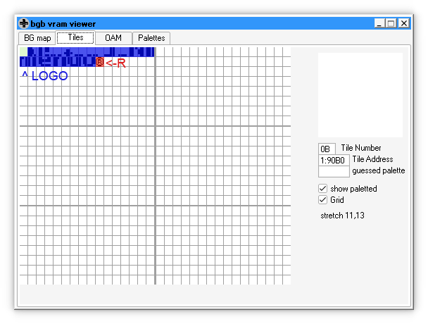
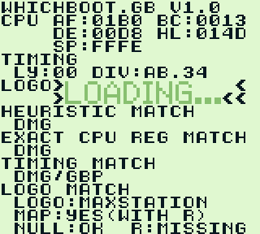

# whichboot.gb

 

Whichboot.gb is a research tool for identifying Gameboy consoles and emulators through software running on the machine/emulator. It is similar in concept to [Matt Currie's which.gb](https://github.com/mattcurrie/which.gb) but it's using different detection mechanisms and is geared toward detecting different aspects of the running machine than which.gb. Whereas which.gb is trying to detect which SoC revision the ROM is running on by triggering various hardware quirks, whichboot.gb is trying to detect which boot ROM was executed. It does this by detecting the CPU register values left by the boot ROM, as well as the timing of the boot process using `DIV` and `LY`, and the logo data left in VRAM. 

The initial purpose of this tool was to provide a non-intrusive way of detecting any undumped boot ROMs that may exist in Gameboy clones. However, it also turned out to be a powerful tool for finding out interesting information about the design process and internal workings of various emulators. I have run whichboot.gb on a wide range of new and old emulators, and using just the methods described below, it can accurately detect many of the older emulators exactly.

## Call to action: Gameboy clone owners

If you are a collector who owns some of the older GB clones, it would be interesting if you could run this ROM on those and document the result. Even if it turns your particular clone has a known boot ROM version, it would help establish a lineage of which boot ROM versions where used in which versions of the clones.

These are the names of a few of the clones that exist:

- Game Fighter
- Fortune SY-3000B
- Fortune SY-3000G
- Bitman 3000B
- Walk Game II
- KF2000
- KF2002
- GB-01
- GB Boy
- SuperBeautiful
- Mega Game
- Crazy Boy
- Cool Boy
- GB Boy
- GB Boy Colour

## Building

Prerequisite: some recent version of RGBDS. Under Linux and presumably macOS, just run `./m.sh`. No Makefile, sorry. Under Windows it should not be too hard to make a `m.bat` file that executes the same commands as `./m.sh`.

## Detection mechanisms

This is a description of the various detection mechanism used by whichboot.gb.

### Heuristic match

This is a simple, non-exhaustive matching algorithm which is meant to represent what a typical game would detect. For example, if the heuristic match says GBC or GBA, it's likely that a typical dual platform game would run in GBC mode. If the heuristic match sayc GBA, some games will load a brighter palette to compensate for the GBA's darker display.

This algorithm also tries to detect Super Gameboy through the recommended method of reading the joypad in multiplayer mode. Some emulators have a special configuration known as GBC+SGB or similar, which allows the game to set a SGB border etc even though the emulated machine is a Gameboy Color. Whichboot.gb can detect this mode as well.

### CPU registers

Whichboot.gb saves all CPU registers on startup and compares them to a reference list for an exact match. The values of the CPU registers depends on the actions of the boot ROM, or in the case of an emulator without boot ROM emulation, what the registers were set to by the emulator.

### Timing match

Whichboot.gb tries to measure the time since the last reset using the `DIV` register, which is somewhat similar to the TSC (timestamp counter) in modern CPUs.

However, since it overflows every 15.625 ms (or at a rate of 64 Hz) it can't reliably log the time since boot in absolute terms. However, it's still useful as a "fingerprint" of the time taken even.

It counts up at a rate of 16384 Hz, which is way slower than the CPU frequency. (1 tick every 64 M cycles, where 1 M cycles is equivalent to 4 T cycles.) Whichboot.gb also tries to detect the hidden bits of DIV by detecting when it changes, which gives an additional fine timer value in the range `0-$3F`, or 6 additional bits of fingerprinting.

### Logo match




A custom boot ROM may copy some other graphical data to VRAM instead of the logo present on the cartridge. This is for example the case with the Gameboy clone called MaxStation which has identical initial CPU registers and timing as the DMG boot ROM, but is detectable through the VRAM contents. Many (older) emulators don't write any data at all to VRAM.

Specifically, this test checks the following things, also indicated in the screenshots above.



**Logo:** Checks for the existence of a logo in tile RAM in the area `$8010-$819F`, aka tiles `$01-$18`. It has the following possible values:
- **No logo.** The logo tile area was filled with null bytes, indicating no logo graphic was copied there. This is common for many emulators, as well as for the Game Fighter version of the boot ROM, which boots immediately without showing a logo on screen. All official boot ROMs will put a copy of the logo here, including SGB.
- **Nintendo.** The standard Nintendo logo graphic was put into tile RAM. This would be expected on any hardware (except as mentioned, Game Figher and Maxstation.) unless a logo swap technique was used.
- **Maxstation.** The Maxstation clone ignores the logo graphics present in the cartridge header, and always copies a "Loading..." graphic into tile RAM from the boot ROM itself.
- **Unknown.** Some unknown graphic was put into tile RAM. You can see what was found in the logo display. This could indicate a yet so far undumped boot ROM.

**Map:** Checks for the existence of a logo and ® symbol in the BG MAP, in the areas `$9904-$9910` and `$9924-$992F`. It has the following possible values:
- **No (GBC/emu/clone).** The logo area of the BG map was empty. This is common on many emulators. This is also normal on GBC, which doesn't fill it in, except for when running two particular hardcoded games. This is also true for the Game Fighter version of the boot ROM, which boots immediately without showing a logo on screen.
- **Yes (with ®).** This is the expected value on most DMGs, all GB Pockets and all SGB. It's also expected on Maxstation. (Even though Maxstation doesn't put any graphic in the tile that usually contains the ®, it does initialize it in the BG map.)
- **Yes (no ®).** This is the expected value for the very early DMG0 boot ROM revision which, lacks the ® symbol completely.

**R:** Check for the existence of the ® symbol in tile RAM in the area `$8190-$819F` aka tile `$19`.
- **Missing.** This area was filled with null bytes. This is expected on DMG0, Maxstation, and anything that doesn't put ahything at all in VRAM like Game Fighter and many emulators.
- **Yes.** The ® symbol exists in tile `$19`.
- **Unknown.** Some unknown graphical data was put into tile `$19`. You can see what was found in the logo display. This could indicate an undumped boot ROM.

**Null:** Checks whether all bytes of VRAM that were not checked above are `$00`. This is expected to literally always be true, except if whichboot.gb was started through a warm reboot, or if the boot ROM did something wild. This was actually the case for an older version of SameBoot shipped with SameBoy 0.13.
- **Ok.** All checked bytes were `$00`.
- **Unk(nown).** Not all checked bytes were `$00`.

## Acknowledgements

I wish to thank beware for making [BGB](https://bgb.bircd.org/), which was useful in debugging this, and every other, Gameboy project I make. I also wish to thank bbbbbr for [dumping the boot ROM of the MaxStation GB clone](https://twitter.com/0xbbbbbr/status/1568132567018389510), which prompted the last minute addition of the logo match check.

## Notes on various emulators

These are some notes of things I've discovered about various emulators by using the ROM. There are some common themes among older emulators, which reveals something about how the emulator might have been programmed.

Usually, the hidden bits of `DIV` are set to 0 at the start of the emulation, and `DIV` might either be set to 0, or some value close to a correct value. What happened when the value is close but not correct, is probably that the whole IO register map was dumped, and `DIV` incremented a couple of times before the value was finally read.

Another common theme is that the initial CPU registers for all SoC types are based on DMG and then modified, for example by setting `A` to `$11` to indicate GBC support, while the other registers are identical to what a DMG would set them to. You could imagine that the emulator's internal logic looks something like this:

```c
// Accurate values for DMG.
A=0x01;
F=0xB0;
B=0x00;
C=0x13;
D=0x00;
E=0xD8;
H=0x01;
L=0x4D;
SP=0xFFFE;

// Change A to 0x11 for GBC detection, but leave the other values as they are.
if(gbc_enabled)
    A=0x11;
```

Another common theme is that `DIV` is broken, for example because it doesn't tick at the right rate. The program detects this condition and warns about it.

Yet another common theme is the existence of a "dream console" mode, SGB+GBC, which runs the ROM in GBC mode while also allowing SGB commands to be sent to set a border and so on. This used to be a common feature in emulators, to allow "the best of both worlds" - a SGB border, combined with full GBC colorization.

### BGB (1.5.10)

Overall accurate timing and initial regs.

### SameBoy (0.15.1)

SameBoy overall has accurate timing and initial regs when using stock boot ROMs. Timings will diverge if using SameBoot instead of the official boot ROM, which is not surprising since it's a complete reimplentation of the boot ROM.

### KiGB

Registers: DMG is accurate. GBC is identical to DMG but with `A==$11` (for GBC detection) and `C==$00` for unclear reasons. Maybe it sets `BC` simultaneously in the GBA check: `BC=gba_mode?0x0100:0;`

Initial registers in SGB mode are also identical to DMG, except `A==$FF`, signaling either GB Pocket or SGB2, regardless of whether SGB1 or SGB2 is selected in the options.

Timing: Always starts with `LY==$00`, and  `DIV==$AF` and fractional bits to 0, regardless of platform.

One interesting aspect of KiGB is that it was one of the first emulators to support execution of boot ROMs after the DMG boot ROM was initially dumped. However, when using the DMG boot ROM, the value of `DIV==$EB FINE==$19` which is a nonsense value. By modifying the boot ROM so it immediately locks itself out (Change the first three bytes to `C3 FC 00` for `jp $00FC`) it turns out that `DIV` is initially set to `$AF` even when running the boot ROM. Ok, but even then `$EB $19` doesn't add up. `$AF` plus the time the DMG boot ROM should take to run, `$AB` comes out to `$5A`. (In modulo 256 arithmetic.) Something about the execution of the boot ROM in KiGB isn't right.

It also supports its own simulation of the GBC boot animation. I thought it would make sense if this was implemented as Gameboy code, and after digging around in the KiGB binary I found out that it is indeed, though only partially. (The graphics are pre-loaded before the emulation run.) However, this does not affect the timing of the ROM, as it seems to signal a reset after the animation is done. This in itself is a new discovery and warrants more research in and of itself.

### VisualBoy Advance

VBA used to be popular because it could run both GB and GBA games, though its GB(C) mode wasn't all that accurate. (Neither was the GBA mode, it turns out.)

Registers: DMG is accurate. SGB and SGB2 are identical to DMG and GBP respectively. GBC/GBA are accurate, except that `F=$B0`. This particular value of `F` is actually impossible on GBC/GBA, and must have been copied over from DMG.

Timing: VBA has `LY=$00` in DMG mode and `LY=$91` in GBC/A mode, which is pretty ok compatibility wise. (Some GBC games may rely on starting in VBlank.) `DIV` is set to 0 initially for all modes.

### HGB

An old, pretty obscure emulator.

Registers: DMG and GBP are accurate. SGB and SGB2 are identical to DMG and GBP respectively. GBC is identical to DMG but with `A==$11`. 

Timing: `LY==$00` initially for all modes. The implementation of `DIV` is seemingly broken. Did not investigate further how it's broken.

### Rew

Another old, forgotten emulator.

Registers: DMG is accurate. SGB is identical to DMG. GBC is accurate.

Both `LY` and `DIV` are initially `$00`. One peculiarity is that it seems that `DIV` is not reset if you choose file/reset, so you get a random `DIV` value on every reset. The implementation of `DIV` is seemingly broken. Did not investigate further how it's broken.


### TI-Boy SE

```
AF:0144
BC:00FE 
DE:0900
HL:0000
SP:FFFE
```

TI-Boy SE is using some pure magic to emulate a Gameboy on some TI calculators by exploiting the similarity of the calculator's Z80 CPU and the Gameboy's SM83 CPU. The CPU values, other than `A` are just what they happened to be when entering the emulation. In particular, `F` contains the Z80's flags, and thus contains values that would be impossible on the SM83.

(TODO: Expand description.)

### TI-Boy CE

Accurate. (TODO: Expand description.)

### Miscellaneous emulators

Whichboot.gb can detect a bunch of other emulators as well that are not (yet) documented here in detail. 
